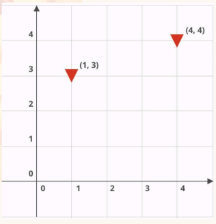

### Pizzabot

Pizzabot will deliver pizzas to all the houses in a neighborhood. In more specific terms, given a grid (where each point
on the grid is one house) and a list of points representing houses in need of pizza delivery, return a list of
instructions for getting Pizzabot to those locations and delivering. An instruction is one of:
N: Move north
S: Move south
E: Move east
W: Move west
D: Drop pizza
Pizzabot always starts at the origin point, (0, 0). As with a Cartesian plane, this point lies at the most south-
westerly point of the grid. See below for an example grid :

Therefore, given the following input string:
5x5 (1, 3) (4, 4)
one correct solution would be:
ENNNDEEEND
In other words: move east once and north thrice; drop a pizza; move east thrice and north
once; drop a final pizza.

### Requirements

You will need a NodeJS environment on your system.

### Run

1. Access Pizzabot file via command line
2. Run npm i 
3. Run chmod +x pizzabot
4. Then run ./pizzabot "5x5 (0, 0)(1, 3)(4, 4)(4, 2)(4, 2)(0, 1)(3, 2)(2, 3)(4, 1)"
Alternatively you can run npm start "5x5 (0, 0)(1, 3)(4,4)(4, 2)(4, 2)(0, 1)(3, 2)(2, 3)(4, 1)"

### Testing

1. Run npm test

Unit testing is done on all the functions using mochaJS and ChaiJS.
Various parameters are tested on each function.

